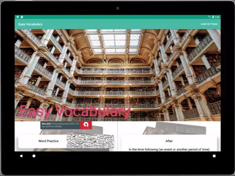

# EasyVocabulary
A vocabulary builder app. This app is simple and easy. You can learn new words everyday, take a quiz to see how much have you learnt and see the progress report of number of words learnt per day. You can also use it as a general dictionary to search for any word.
Use
## Libraries
ButterKnife, Timber, ExoPlayer, Retrofit, MPAndroidChart, Espresso, Stetho, Glide etc.
## Project Overview
In this Project I have included :
* Fragments to display the app in different styles on both phone/tablet and potrait/landscape mode.
* Once the app runs, a widget would be added showing a random word and its meaning which on clicking will open app's main screen.
* Main Menu has 4 options, namely : Word Practice, which shows couple of words and their meanings. Quiz, which will test you based on the words learnt. Progress, which shows the number of words learnt per day. Dictionary, lets you search for any word meaning.
* All the activities/fragments have main menu to return to or browse to any other activity/fragment.
* Main Menu has user preference where user can change his/her preferencesfor number of words shown the word activity, Level of words and Reminder frequency.
* I will soon be adding some more features to my app, releasing new versions.
## Installation
Clone the GitHub repository.
```
$ git clone https://github.com/sumitasharma/EasyVocabulary.git
```
## Application Preview
 | 
